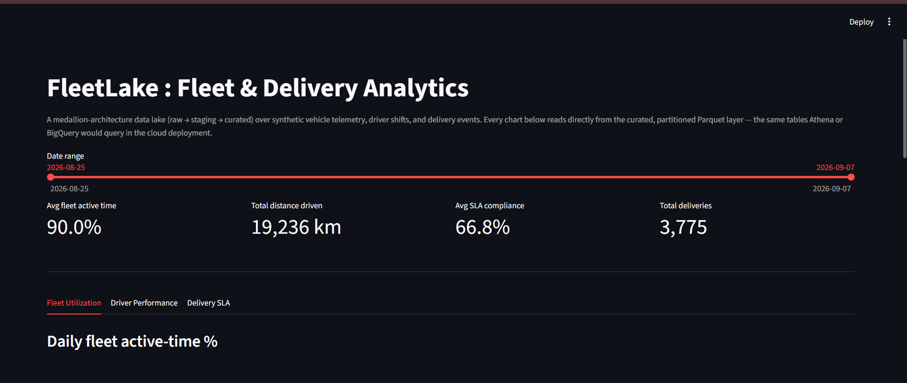
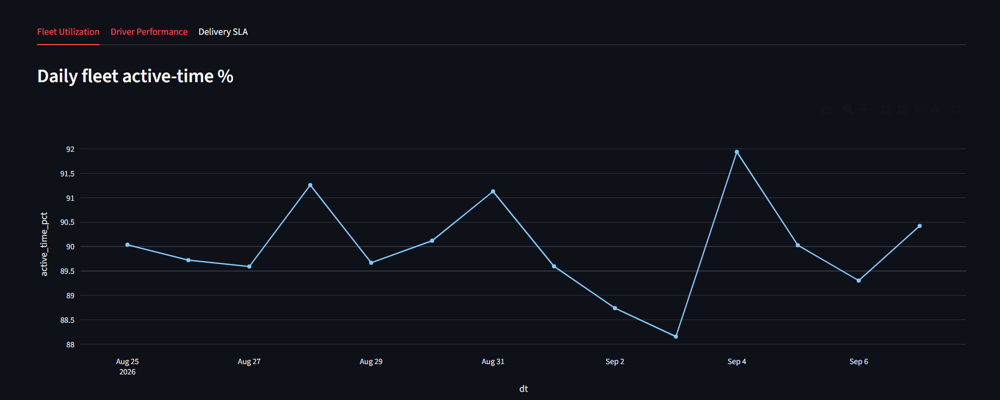
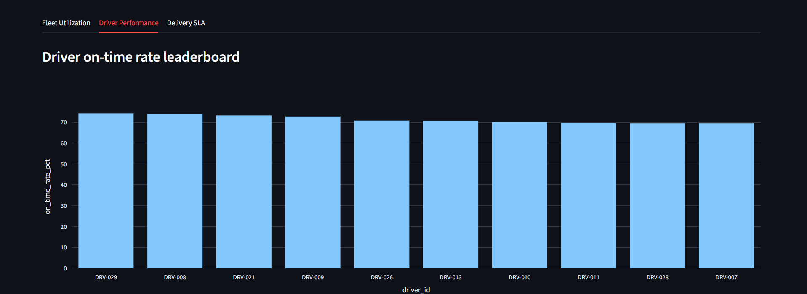
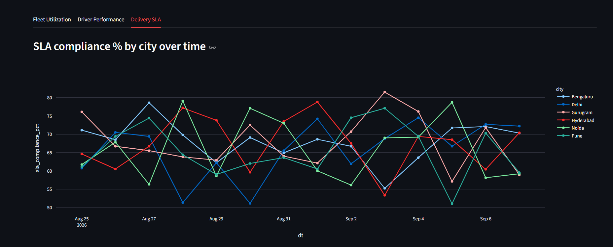
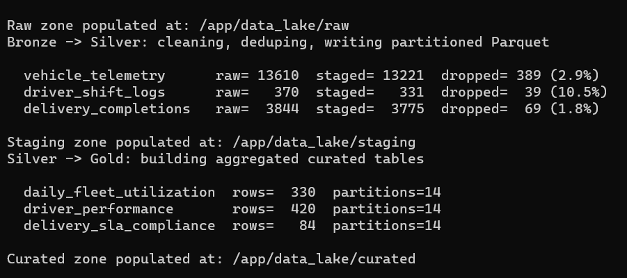
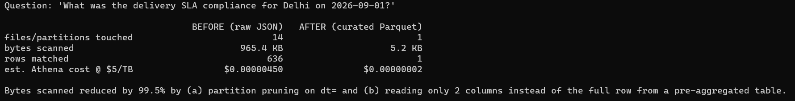
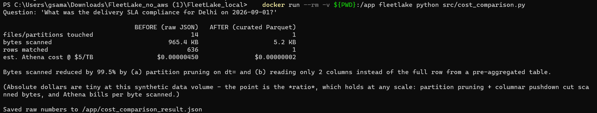

# FleetLake

## **Live dashboard:** : 

**A data lake and analytics pipeline for fleet & last-mile delivery operations** : vehicle telemetry, driver shift logs, and delivery completions, built on a bronze/silver/gold (raw/staging/curated) medallion architecture designed after cloud data warehouses like AWS S3+Glue+Athena (or the GCP equivalent, Cloud Storage+Dataproc+BigQuery), with SQL analytics and a live Streamlit dashboard on top.


## Streamlit App



### Fleet Utilisation tab



### Driver Performance tab


### Delivery SLA


### Highlights

- **3-zone medallion data lake** (raw → staging → curated) mirroring how a logistics company actually organizes fleet and delivery data, not a single script pushing a CSV around.
- **Real cleaning problems, solved**: raw ingestion is seeded with duplicate events, nulls, and malformed records (the kind at-least-once delivery pipelines actually produce); the staging job measurably fixes them. 
- **Partitioned, columnar storage**: every layer is Hive-partitioned by date and stored as Parquet, queryable with standard SQL (via DuckDB locally: the same partition-pruning and columnar pushdown Athena/BigQuery use in production).
- **Cost-awareness, with numbers**: a before/after benchmark shows a **99.5% reduction in data scanned** per query after partitioning + Parquet, measured, not estimated (see below).
---


## Why this project

Most "data pipeline" portfolio projects are a single script that reads a CSV and writes another CSV. That doesn't reflect how data actually moves in a real fleet/logistics company, and it skips the two things that separate a data engineer from someone who can write a Python loop:

1. **Partitioning** : organizing data on disk so a query only reads what it needs.
2. **File format** : choosing a columnar format so a query only reads the columns it needs.

Both decisions directly control how much data an engine like Athena or BigQuery has to scan, and since those engines bill (and get slower) per byte scanned, this is a cost and performance decision, not just a style choice. This project is built to demonstrate that reasoning end to end, with numbers to back it up.

---

## Architecture

```
                      ┌─────────────────────────────────────────────────┐
                      │                  FleetLake                       │
                      └─────────────────────────────────────────────────┘

  Source systems                Bronze (raw/)         Silver (staging/)          Gold (curated/)
  ───────────────               ─────────────          ──────────────────         ─────────────────
  Vehicle telemetry   ──JSON──▶  raw/vehicle_telemetry/   clean, dedupe,   ──▶  curated/daily_fleet_
  (GPS, speed, fuel)             dt=YYYY-MM-DD/           type-cast,            utilization/
                                                           partitioned            dt=YYYY-MM-DD/
  Driver shift logs   ──JSON──▶  raw/driver_shift_logs/   Parquet          ──▶  curated/driver_
  (clock in/out)                 dt=YYYY-MM-DD/           dt=YYYY-MM-DD/         performance/
                                                                                  dt=YYYY-MM-DD/
  Delivery events      ──JSON──▶ raw/delivery_completions/                  ──▶  curated/delivery_
  (assigned/completed)           dt=YYYY-MM-DD/                                  sla_compliance/
                                                                                  dt=YYYY-MM-DD/
                                        │                       │                        │
                                        ▼                       ▼                        ▼
                                 (Glue crawler / manual DDL registers all three zones in the
                                  Glue Data Catalog → queryable from Athena with standard SQL)
                                        │
                                        ▼
                              Athena analytical queries  +  Streamlit dashboard
```

**Bronze (`raw/`)** : data lands exactly as the source system sent it: JSON, one folder per ingestion day, no cleaning. This is deliberately messy: it contains duplicate events (simulating at-least-once delivery from retried API calls), null fields, and a few malformed rows, because that's what raw ingestion actually looks like.

**Silver (`staging/`)** : a Glue job (or the local Python equivalent) reads raw JSON, drops malformed/duplicate rows, casts types, and writes the result as **partitioned Parquet**. This is the layer every downstream job and analyst should build on instead of raw, because it's already trustworthy.

**Gold (`curated/`)** : aggregated, analysis-ready tables built from staging: daily fleet utilization, driver performance, and delivery SLA compliance. These are what Athena/BigQuery/the dashboard actually query — small, pre-aggregated, and partitioned, so even a dashboard refresh is cheap.

This bronze/silver/gold split (the "medallion architecture") exists so that:
- raw data is never mutated or lost, you can always replay staging/curated from it if a transformation rule was wrong,
- each layer has one clear job, so a broken curated table doesn't mean re-deriving everything from scratch, and
- consumers (analysts, dashboards, other services) only ever touch curated, they never have to know how the cleaning happened.

---

### Pipeline run : cleaning & deduplication



### Query cost comparison : raw JSON vs. partitioned Parquet





---

## Partitioning strategy

Every zone is partitioned by **`dt` (ingestion/event date)**, using Hive-style paths: `dataset/dt=2026-09-01/part-0000.parquet`. This is the standard partitioning scheme Athena, BigQuery, and Spark all recognize automatically.

Why `dt` and not something else (e.g. `city`, `vehicle_id`):
- Almost every real query here is time-scoped : "yesterday's SLA numbers," "last 7 days," "this month's utilization", so date is the highest-value pruning key.
- `dt` has bounded, predictable cardinality (one new partition per day), unlike `vehicle_id` (25+ partitions, growing) or `driver_id`, which would create far more small files than the data volume justifies (the classic "small files problem" that kills Spark/Athena performance instead of helping it).
- Curated tables also carry `city` and `vehicle_id` as regular columns, not partition keys, Parquet's columnar storage + Athena's *predicate pushdown* still avoids reading unrelated column data even without partitioning on those fields.


---

## Why Parquet over CSV/JSON

| | CSV / JSON | Parquet |
|---|---|---|
| Layout | row-oriented | columnar |
| Reads only needed columns? | No, the engine has to parse every field of every row even if the query selects 2 columns | Yes, column pushdown skips columns not referenced in the query |
| Compression | poor (repeated text, no type info) | strong (typed, dictionary/RLE encoding per column, snappy block compression) |
| Schema | none (JSON) / inferred, fragile (CSV) | embedded in the file : no guessing types on every read |
| Splittable for parallel reads | JSON often isn't; CSV is fragile with embedded newlines/commas | yes, natively |
| Typical size vs. equivalent JSON | baseline | ~4 to 8x smaller in this project |


---

## Measured before/after: query cost impact

`src/cost_comparison.py` runs the same real question two ways and measures actual bytes read off disk (not estimated):

> "What was the delivery SLA compliance for Delhi on 2026-09-01?"

| | **Before** — raw JSON, no partitioning | **After** — curated, partitioned Parquet |
|---|---|---|
| Files/partitions touched | 14 (every day's file has to be opened, nothing to prune on) | 1 (only the `dt=2026-09-01` partition is read) |
| Bytes scanned | 965.4 KB | 5.2 KB |
| Rows returned | 636 | 1 |
| Est. Athena cost @ $5/TB scanned | $0.0000045 | $0.00000002 |
| **Reduction** | | **99.5% less data scanned** |

The absolute dollar amounts are meaningless at this synthetic data size, the point is the **ratio**. That 99.5% reduction comes from two independent effects stacking:
1. **Partition pruning** : the `dt=` folder structure means the engine skips 13 of 14 days without opening them.
2. **Columnar + pre-aggregation** : Parquet only reads the 2 columns the query needs, from a table that's already aggregated down from thousands of raw events to one row per (city, day).

At real fleet-telemetry volumes (millions of GPS pings/day across a large fleet, not thousands), this is the difference between a query that costs cents and finishes in a second, and one that costs dollars and times out. Run `python3 src/cost_comparison.py` yourself to reproduce these numbers, nothing here is hardcoded, it's measured from the actual files in `data_lake/`.

---

## Analytical queries

Five queries in [`queries/analytical_queries.sql`](queries/analytical_queries.sql), written as standard Athena SQL against the Glue Data Catalog tables (and runnable locally, unmodified in logic, via `src/query_engine.py`):

1. **Most underutilized vehicles** : lowest average active-time %, candidates for fleet rightsizing.
2. **Driver leaderboard, last 7 days** : top drivers by on-time delivery rate.
3. **City-level SLA compliance trend** : day-by-day compliance % per city, for a dashboard trend line.
4. **Worst SLA breach days** : (city, day) combinations with the most breaches, for ops triage.
5. **Fleet utilization vs. driver hours** : a join across two curated tables, checking whether higher vehicle active-time correlates with driver hours logged that day.

---

## Project structure

```
FleetLake/
├── data_lake/
│   ├── raw/            # bronze — messy JSON, as ingested
│   ├── staging/        # silver — cleaned, deduped, partitioned Parquet
│   └── curated/         # gold — aggregated, analysis-ready Parquet
├── src/
│   ├── generate_raw_data.py     # synthetic data generator (bronze)
│   ├── transform_to_staging.py  # clean/dedupe/partition (bronze → silver)
│   ├── build_curated.py         # aggregations (silver → gold)
│   ├── query_engine.py          # local Athena-equivalent (DuckDB) + the 5 queries
│   └── cost_comparison.py       # measured before/after scan-size comparison
├── queries/
│   └── analytical_queries.sql   # the 5 analytical queries, standard Athena SQL
├── app/
│   └── streamlit_app.py         # dashboard over the curated layer
├── run_pipeline.py              # one-command orchestrator (runs the whole local pipeline)
└── requirements.txt
```

---

## How to run

Requires Python 3.10+.

```bash
git clone <your-repo-url>
cd FleetLake
pip install -r requirements.txt

# Run the entire pipeline: generate raw data → stage → curate → query → cost comparison
python3 run_pipeline.py
```

That single command populates `data_lake/raw`, `data_lake/staging`, and `data_lake/curated`, then runs and prints the 5 analytical queries and the before/after cost comparison.

Or run each stage individually:

```bash
python3 src/generate_raw_data.py      # bronze
python3 src/transform_to_staging.py   # bronze → silver
python3 src/build_curated.py          # silver → gold
python3 src/query_engine.py           # run the 5 analytical queries
python3 src/cost_comparison.py        # before/after scan-size comparison
```

Then launch the dashboard:

```bash
streamlit run app/streamlit_app.py
```

---

## Tech stack

- **Storage layout**: S3-style 3-zone bucket (raw / staging / curated), Hive-partitioned by date , reproduced locally as a plain directory tree
- **Transform**: pandas + PyArrow (mirrors the cleaning/dedup/aggregation logic a Spark/Glue job would run in production, at this data volume)
- **File format**: Apache Parquet with Snappy compression
- **Catalog + SQL**: DuckDB : same SQL, same partition-pruning behavior Athena/BigQuery use in production
- **Dashboard**: Streamlit + Plotly

---

## Notes on the synthetic data

Data is generated by `src/generate_raw_data.py` for 25 vehicles and 30 drivers across 14 days, and includes intentional data-quality issues (duplicate events, nulls, a few wrong-typed fields) so the cleaning/dedup step in `transform_to_staging.py` has real work to do and its effect is visible in the row counts it prints. Regenerate with different volumes/seeds by editing `NUM_DAYS`, `NUM_VEHICLES`, `NUM_DRIVERS` at the top of that file.

---


